# Mediatlas - end to end Healthcare Education logbook System

Mediatlas is a modern, enterprise healthcare education system designed for medical education. It bridges the gap between students, clinical preceptors, and institutional administrators by providing a seamless interface for tracking clinical rotations, patient encounters, and educational competencies.

The platform replaces traditional paper logbooks with a real-time, digital solution that ensures data accuracy, strictly enforces privacy standards, and provides actionable insights into student performance.

---

## 🚀 Key Features

### For Students
- **Digital Logbook**: Easily record daily clinical activities, patient demographics, and learning reflections.
- **Progress Tracking**: Visualize clinical hours and patient encounters against rotation requirements.
- **Mobile First**: Optimized for use on tablets and phones during clinical rounds.

### For Instructors & Preceptors
- **Efficient Review**: streamlined dashboard to review, approve, or reject student logs with feedback.
- **Performance Monitoring**: Track student engagement and clinical exposure in real-time.
- **Quick Validation**: Bulk approve entries to save time during busy clinical shifts.

### For Administrators
- **Institution Management**: Manage multiple hospitals and clinical sites from a central dashboard.
- **User Management**: Role-based access control for students, faculty, and external preceptors.
- **Analytics**: Generate institution-wide reports on student placement coverage and competence achievement.

---

## � System Workflow

```mermaid
graph TD
    %% Roles
    Admin([👤 Admin])
    Student([🎓 Student])
    Instructor([👨‍⚕️ Instructor/Preceptor])

    %% System States
    LogPending[📝 Log Entry Pending]
    LogApproved[✅ Log Entry Approved]
    LogRejected[❌ Log Entry Rejected]
    Stats[📊 Dashboard Analytics]
    App{Mediatlas App}
    Decision{Approve?}

    %% Admin Workflow
    Admin -->|1. Invite Users| Student
    Admin -->|1. Invite Users| Instructor
    Admin -->|Monitor| Stats

    %% Student Workflow
    Student -->|2. Register & Login| App
    App -->|3. Record Clinical Experience| LogPending
    LogRejected -->|5a. Edit & Resubmit| LogPending

    %% Instructor Workflow
    Instructor -->|4. Review Pending Logs| LogPending
    LogPending -->|Decision| Decision
    Decision -->|Yes| LogApproved
    Decision -->|No| LogRejected

    %% Data Flow
    LogApproved --> Stats
    LogPending -.->|Real-time Updates| Stats
```



---

## �🛠️ Technical Architecture

Mediatlas is built on a modern, scalable technology stack designed for performance and reliability.

### Frontend
- **Framework**: React 18 with TypeScript for type-safe, component-based UI.
- **Build Tool**: Vite for lightning-fast development and optimized production builds.
- **Styling**: Tailwind CSS for responsive, utility-first design with a custom design system.
- **Components**: Radix UI primitives for accessible, headless interactive components.
- **State Management**: Real-time data synchronization using Supabase subscriptions.

### Backend
- **API**: Python Django REST Framework (DRF) serving a robust, RESTful API.
- **Database**: PostgreSQL (via Supabase) for relational data integrity and complex querying.
- **Authentication**: JWT-based secure authentication with role-based permissions (RBAC).
- **Standards**: FHIR-compatible data models for healthcare interoperability.

### Infrastructure
- **Real-time Engine**: Supabase Realtime for instant updates on status changes.
- **Security**: Row Level Security (RLS) policies and strict data isolation between institutions.

---

## 🏁 Getting Started

Follow these instructions to set up the project locally for development.

### Prerequisites
- Node.js (v18+)
- Python (v3.10+)
- Git

### Installation

1. **Clone the repository**
   ```bash
   git clone <repository-url>
   cd ClinLogix
   ```

2. **Frontend Setup**
   ```bash
   # Install dependencies
   npm install

   # Start the development server
   npm run dev
   ```
   The application will be available at `http://localhost:3000`.

3. **Backend Setup**
   ```bash
   cd backend

   # Create virtual environment
   python -m venv venv
   source venv/bin/activate  # On Windows: venv\Scripts\activate

   # Install dependencies
   pip install -r requirements.txt

   # Run migrations
   python manage.py migrate

   # Start the Django server
   python manage.py runserver
   ```
   The API will be available at `http://localhost:8000`.

---

## 📂 Project Structure

```
ClinLogix/
├── src/                  # Frontend Source Code
│   ├── components/       # Reusable UI components & Feature pages
│   ├── services/         # API clients and Data handling
│   ├── lib/              # Third-party library configurations (Supabase, Utils)
│   └── App.tsx           # Main application entry & Routing
├── backend/              # Backend Source Code
│   ├── api/              # Django Apps (Views, Models, Serializers)
│   ├── core/             # Project Configuration (Settings, URLs)
│   └── secure/           # Security & Authentication logic
└── public/               # Static assets
```

## 📄 License

This project is proprietary and confidential. Unauthorized copying of this file, via any medium is strictly prohibited.
